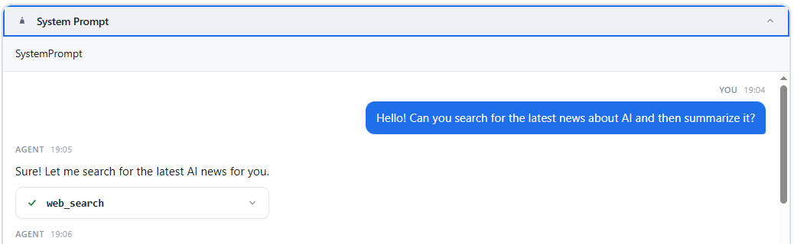
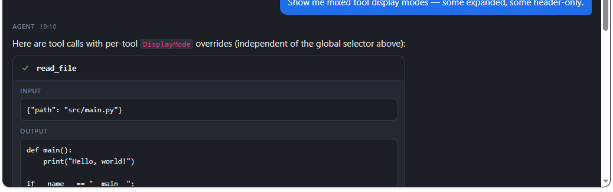
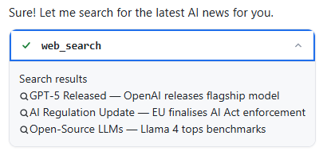

# BlazorAgentView

A Blazor component library for rendering AI agent chat interfaces with first-class tool call visualisation, Markdown support, streaming, dark mode, and full per-message customisation - all in a single `<AgentChatView>` component.

[](https://www.nuget.org/packages/BlazorAgentView)
[](LICENSE)
[](https://dotnet.microsoft.com/)


  
  
  


---

## Contents

- [Features](#features)
- [Quick Start](#quick-start)
- [AgentChatOptions reference](#agentchatoptions-reference)
- [ChatMessage API](#chatmessage-api)
- [ToolCall API](#toolcall-api)
- [Tool call display modes](#tool-call-display-modes)
- [Per-message customisation](#per-message-customisation)
- [Images & video in messages](#images--video-in-messages)
- [Custom tool output renderer](#custom-tool-output-renderer)
- [Custom Markdown renderer](#custom-markdown-renderer)
- [Theming with CSS variables](#theming-with-css-variables)
- [Streaming messages](#streaming-messages)
- [AgentChatView imperative API](#agentchatview-imperative-api)

---

## Features

- 💬 **Chat bubbles** — user bubbles, borderless agent messages (GitHub Copilot-style), collapsible system-prompt banner
- 🔧 **Tool call cards** — 4 display modes (collapsible, expanded, header-only, always-open), per-tool override, cancel button, animated state icons (pending / running / success / failed / cancelled)
- ✍️ **Markdown** — rendered via [Markdig](https://github.com/xoofx/markdig); fenced code blocks, tables, blockquotes, inline images — swappable via `IMarkdownRenderer`
- 📡 **Streaming** — animated typing indicator; append tokens incrementally via `AppendToMessage`
- 🌙 **Dark mode** — `Theme = "dark"` or customise every colour via CSS variables
- 🏷️ **Per-message labels** — override or hide the "Agent" / "You" header on any individual message
- ⏱️ **Per-message timestamps** — show or hide independently from the global toggle
- 🖼️ **Custom content** — `RenderFragment` per message **or** a `RenderFragment<ToolCall>` renderer for any tool type
- 🔍 **Virtualisation** — opt-in for very long chat histories
- ♿ **Accessibility** — ARIA roles, keyboard-navigable tool cards

---

## Quick Start

### 1 — Install

```
dotnet add package BlazorAgentView
```

### 2 — Add the stylesheet

In `App.razor` (or `_Host.cshtml`), include the CSS **after** Bootstrap / your app styles:

```html
<link rel="stylesheet" href="_content/BlazorAgentView/blazor-agent-view.css" />
```

### 3 — Add the using

In `_Imports.razor`:

```razor
@using BlazorAgentView.Components
@using BlazorAgentView.Models
```

### 4 — Drop in the component

```razor
@code {
    private List<ChatMessage> _messages = new()
    {
        new ChatMessage { Role = MessageRole.User,      Content = "Hello!" },
        new ChatMessage { Role = MessageRole.Assistant, Content = "Hi! How can I help?" }
    };
}

<div style="height: 600px;">
    <AgentChatView Messages="_messages" />
</div>
```

> ⚠️ The component fills **100% of its parent's height**. Always give the parent an explicit height.

### 5 — (Optional) Register a custom Markdown renderer

The default renderer uses Markdig — no registration required. To replace it:

```csharp
builder.Services.AddSingleton<IMarkdownRenderer, MyMarkdownRenderer>();
```

---

## AgentChatOptions reference

Pass an `AgentChatOptions` instance to the `Options` parameter.

| Property | Type | Default | Description |
|---|---|---|---|
| `ShowTimestamps` | `bool` | `true` | Show `HH:mm` in every message header. Overridable per message via `ChatMessage.ShowTimestamp`. |
| `EnableMarkdown` | `bool` | `true` | Render message content as Markdown. |
| `SystemPromptMarkdown` | `bool` | `false` | Render the system-prompt banner text as Markdown. |
| `EnableAssistantBubble` | `bool` | `false` | `false` = borderless agent messages (default). `true` = coloured bubble. |
| `AutoScroll` | `bool` | `true` | Scroll to bottom when new messages arrive. |
| `EnableVirtualization` | `bool` | `false` | Virtualise the message list for long histories. |
| `ToolCallDisplay` | `ToolCallDisplayMode` | `Collapsible` | Default display mode for all tool cards. Overridable per tool via `ToolCall.DisplayMode`. |
| `Theme` | `string?` | `null` | `"dark"` activates the built-in dark theme. |
| `CssVariables` | `Dictionary<string, string>` | `{}` | Inline CSS variable overrides (see [Theming](#theming-with-css-variables)). |

```razor
<AgentChatView Messages="_messages"
               SystemPrompt="You are a helpful assistant."
               Options="@(new AgentChatOptions
               {
                   ShowTimestamps        = true,
                   EnableMarkdown        = true,
                   SystemPromptMarkdown  = true,
                   EnableAssistantBubble = false,
                   ToolCallDisplay       = ToolCallDisplayMode.Collapsible,
                   Theme                 = "dark"
               })" />
```

---

## ChatMessage API

```csharp
public class ChatMessage
{
    public string          Id            { get; set; }  // auto-generated
    public MessageRole     Role          { get; set; }  // User | Assistant | System | Tool
    public string          Content       { get; set; }
    public List<ToolCall>  ToolCalls     { get; set; }
    public DateTimeOffset  Timestamp     { get; set; }  // defaults to UtcNow
    public bool            IsStreaming   { get; set; }  // shows animated typing dots

    // Per-message header overrides
    // null  = default label ("Agent" / "You" / ...)
    // ""    = hide label entirely
    // "Bob" = show "Bob"
    public string?         RoleLabel     { get; set; }

    // null  = inherit AgentChatOptions.ShowTimestamps
    // true / false = explicit per-message override
    public bool?           ShowTimestamp { get; set; }

    // Replaces Content + ToolCalls rendering entirely for this message
    public RenderFragment? CustomContent { get; set; }
}
```

**Header visibility rules:**

| `RoleLabel` | Effect |
|---|---|
| `null` (default) | Built-in label ("Agent", "You", …) |
| `"Custom"` | Any custom string |
| `""` (empty) | Label hidden |

| `ShowTimestamp` | Effect |
|---|---|
| `null` (default) | Inherits `AgentChatOptions.ShowTimestamps` |
| `true` / `false` | Explicit per-message |

> The entire header row disappears automatically when both label and timestamp are invisible.

---

## ToolCall API

```csharp
public class ToolCall
{
    public string               Id            { get; set; }  // auto-generated
    public string               ToolName      { get; set; }
    public string?              Input         { get; set; }
    public string?              Output        { get; set; }
    public ToolState            State         { get; set; }  // Pending | Running | Success | Failed | Cancelled
    public ToolCallDisplayMode? DisplayMode   { get; set; }  // per-tool override; null = global
    public RenderFragment?      CustomContent { get; set; }  // replaces default I/O rendering
}
```

**`ToolState` values and their indicators:**

| Value | Icon |
|---|---|
| `Pending` | Animated dots |
| `Running` | Animated dots (accent colour) |
| `Success` | ✔ green checkmark |
| `Failed` | ✖ red cross |
| `Cancelled` | ⊘ grey circle-slash |

---

## Tool call display modes

`ToolCallDisplayMode` controls how a card exposes its input/output. Set globally on `AgentChatOptions.ToolCallDisplay` or override per card via `ToolCall.DisplayMode`.

| Mode | Behaviour |
|---|---|
| `Collapsible` | Toggle button present, starts **collapsed** (default) |
| `CollapsibleExpanded` | Toggle button present, starts **expanded** |
| `AlwaysExpanded` | Details always visible, toggle hidden |
| `HeaderOnly` | Only tool name + state icon — no body |

```csharp
// Global default — all cards start collapsed
Options = new AgentChatOptions { ToolCallDisplay = ToolCallDisplayMode.Collapsible };

// Individual overrides — all four modes mixed in the same message
new ToolCall { ToolName = "read_file",      DisplayMode = ToolCallDisplayMode.AlwaysExpanded      }
new ToolCall { ToolName = "list_directory", DisplayMode = ToolCallDisplayMode.HeaderOnly           }
new ToolCall { ToolName = "run_tests",      DisplayMode = ToolCallDisplayMode.CollapsibleExpanded  }
new ToolCall { ToolName = "deploy",         DisplayMode = ToolCallDisplayMode.AlwaysExpanded       }
```

---

## Per-message customisation

Every message independently overrides header label and timestamp, regardless of global options:

```csharp
// No header at all — continuation line, no visual noise
new ChatMessage
{
    Role          = MessageRole.Assistant,
    Content       = "...continued from above.",
    RoleLabel     = "",     // hides "Agent"
    ShowTimestamp = false
}

// Custom display name instead of "You"
new ChatMessage
{
    Role          = MessageRole.User,
    Content       = "What's the weather?",
    RoleLabel     = "Felix",
    ShowTimestamp = false
}

// Keep label, hide timestamp only
new ChatMessage
{
    Role          = MessageRole.Assistant,
    Content       = "Here is your answer.",
    ShowTimestamp = false
}

// Full custom content (replaces Content + ToolCalls entirely)
new ChatMessage
{
    Role          = MessageRole.Assistant,
    CustomContent = @<div class="my-card">Anything Blazor can render</div>
}
```

---

## Images & video in messages

### Images

Standard Markdown image syntax works in both message content and the system-prompt banner (`SystemPromptMarkdown = true`):

```csharp
new ChatMessage
{
    Role    = MessageRole.Assistant,
    Content = "Here is the chart:\n\n"
}
```

Markdig renders `` as a standard `` tag. Add `max-width: 100%` via CSS variables or your stylesheet if needed.

### Video & arbitrary HTML

Raw HTML is disabled in the Markdown pipeline (XSS safety). Use `CustomContent` for videos or other rich media:

```razor
@code {
    private RenderFragment VideoContent =>
        @<video src="https://example.com/demo.mp4" controls style="max-width:100%;border-radius:8px;"></video>;

    private ChatMessage VideoMessage => new()
    {
        Role          = MessageRole.Assistant,
        CustomContent = VideoContent
    };
}
```

---

## Custom tool output renderer

Supply a `RenderFragment<ToolCall>` to `ToolContentTemplate` on `<AgentChatView>`. Return `null!` for tools you don't customise — they automatically fall back to the default input/output display.

```razor
<AgentChatView Messages="_messages" ToolContentTemplate="ToolTemplate" />

@code {
    private RenderFragment<ToolCall> ToolTemplate => tool =>
    {
        // Only customise web_search — all other tools use built-in rendering
        if (tool.ToolName != "web_search") return null!;

        return __builder =>
        {
            __builder.OpenElement(0, "div");
            __builder.AddAttribute(1, "class", "my-search-results");

            var lines = (tool.Output ?? "").Split('\n', StringSplitOptions.RemoveEmptyEntries);
            int seq = 2;
            foreach (var line in lines)
            {
                __builder.OpenElement(seq++, "div");
                __builder.AddAttribute(seq++, "class", "my-search-row");
                __builder.AddContent(seq++, line);
                __builder.CloseElement();
            }

            __builder.CloseElement();
        };
    };
}
```

> The template receives the full `ToolCall` object — branch on `ToolName`, `State`, `Input`, `Output`, or any data you store in it.

---

## Custom Markdown renderer

Implement `IMarkdownRenderer` and register it to swap the built-in Markdig pipeline:

```csharp
using BlazorAgentView.Services;
using Microsoft.AspNetCore.Components;

public class MyMarkdownRenderer : IMarkdownRenderer
{
    public MarkupString Render(string markdown)
    {
        var html = MyLib.ToHtml(markdown);
        return new MarkupString(html);
    }
}
```

```csharp
// Program.cs
builder.Services.AddSingleton<IMarkdownRenderer, MyMarkdownRenderer>();
```

---

## Theming with CSS variables

Pass overrides via `AgentChatOptions.CssVariables` or your own stylesheet.

| Variable | Default | Purpose |
|---|---|---|
| `--bav-bg` | `#ffffff` | Chat surface background |
| `--bav-surface` | `#f7f8fa` | Secondary surface (tool cards, input row) |
| `--bav-surface-strong` | `#eef0f4` | Hover / active surface |
| `--bav-border` | `#e3e5ea` | Default border colour |
| `--bav-border-strong` | `#c9cdd6` | Emphasis border |
| `--bav-text` | `#1f2328` | Primary text |
| `--bav-text-secondary` | `#5b6472` | Secondary / metadata text |
| `--bav-text-muted` | `#8a93a1` | Muted / disabled text |
| `--bav-accent` | `#1f6feb` | Accent / interactive colour |
| `--bav-agent-bubble-bg` | `#eef4ff` | Agent bubble fill (`EnableAssistantBubble = true`) |
| `--bav-user-bubble-bg` | `#1f6feb` | User bubble fill |
| `--bav-user-bubble-text` | `#ffffff` | User bubble text |
| `--bav-tool-success` | `#1a7f37` | Success state colour |
| `--bav-tool-failed` | `#cf222e` | Failed state colour |
| `--bav-tool-running` | `#1f6feb` | Running state colour |
| `--bav-tool-pending` | `#b58400` | Pending state colour |
| `--bav-tool-cancelled` | `#6e7681` | Cancelled state colour |
| `--bav-font-family` | system-ui / Segoe UI | UI font stack |
| `--bav-font-mono` | ui-monospace / Consolas | Code / tool I/O font |
| `--bav-border-radius` | `12px` | Card corner radius |
| `--bav-border-radius-sm` | `6px` | Small element corner radius |
| `--bav-shadow-sm` | subtle | Card shadow |

```razor
Options = new AgentChatOptions
{
    Theme = "dark",
    CssVariables = new()
    {
        ["--bav-accent"]         = "#7c3aed",
        ["--bav-user-bubble-bg"] = "#7c3aed",
        ["--bav-tool-running"]   = "#7c3aed"
    }
};
```

---

## Streaming messages

```razor
@code {
    private AgentChatView _chatView = default!;

    private async Task StreamReply()
    {
        var msg = new ChatMessage
        {
            Role        = MessageRole.Assistant,
            Content     = "",
            IsStreaming = true
        };
        _chatView.AddMessage(msg);

        var tokens = new[] { "Hello", " there,", " how", " can", " I", " help?" };
        foreach (var token in tokens)
        {
            await Task.Delay(60);
            _chatView.AppendToMessage(msg.Id, token);
        }

        msg.IsStreaming = false;
        StateHasChanged();
    }
}
```

---

## AgentChatView imperative API

| Method | Description |
|---|---|
| `AddMessage(ChatMessage)` | Append a message and auto-scroll |
| `AppendToMessage(string id, string text)` | Append text to an existing message (streaming) |
| `UpdateToolState(string msgId, string toolId, ToolState)` | Update the state of a specific tool call |

---

## Component parameters

| Parameter | Type | Description |
|---|---|---|
| `Messages` | `IEnumerable<ChatMessage>` | The message list to render |
| `SystemPrompt` | `string?` | Optional system-prompt shown in the collapsible top banner |
| `Options` | `AgentChatOptions` | Global display options |
| `OnCancelTool` | `EventCallback<string>` | Fired on Cancel click — receives `ToolCall.Id` |
| `ToolContentTemplate` | `RenderFragment<ToolCall>?` | Custom renderer for tool card body; return `null!` to use default |
| `UserInputContent` | `RenderFragment?` | Optional footer slot for a custom input bar |

---

## License

MIT © Felix Klakow
